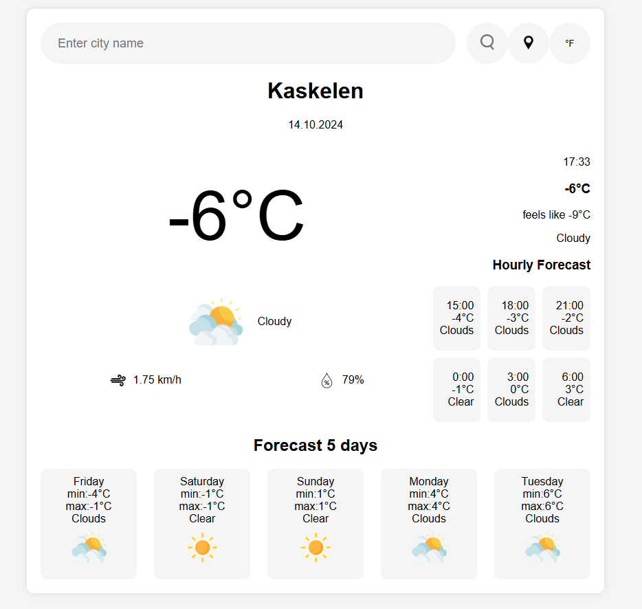
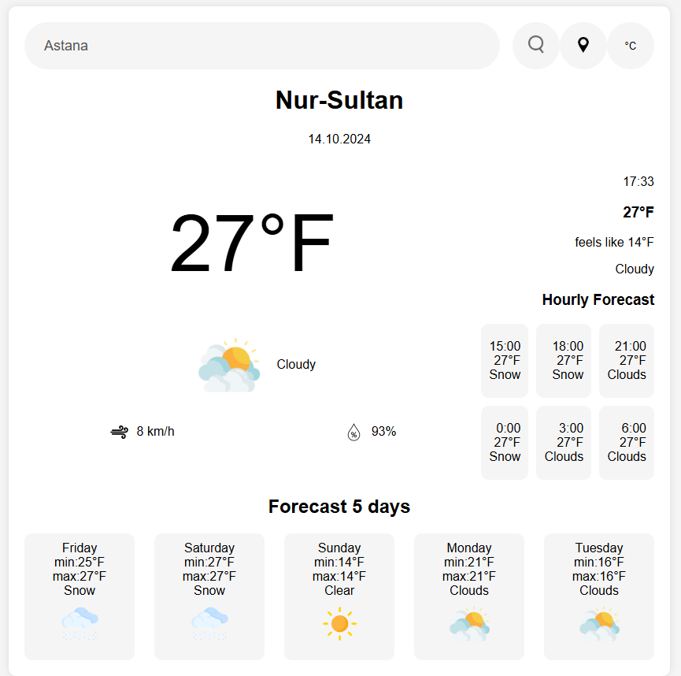
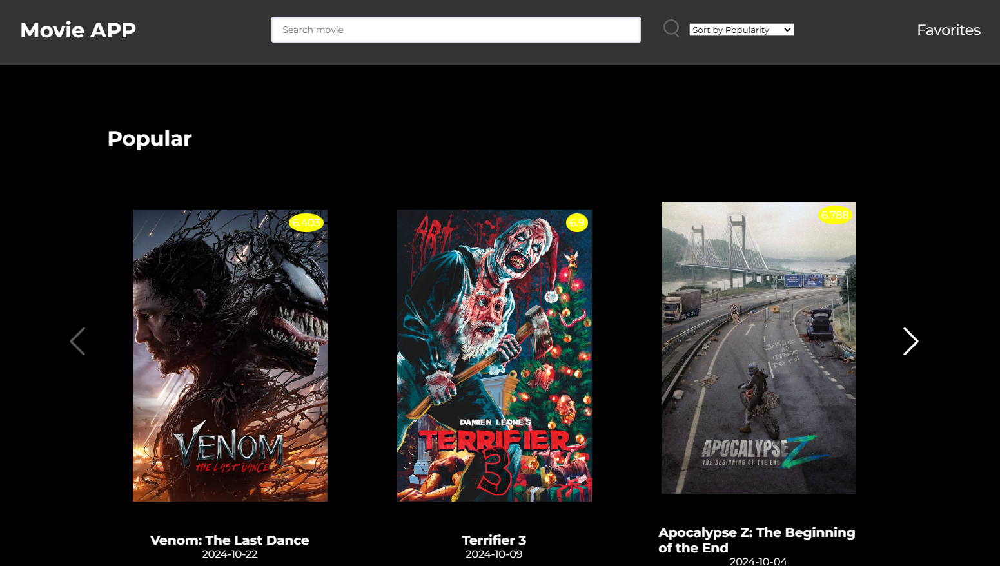
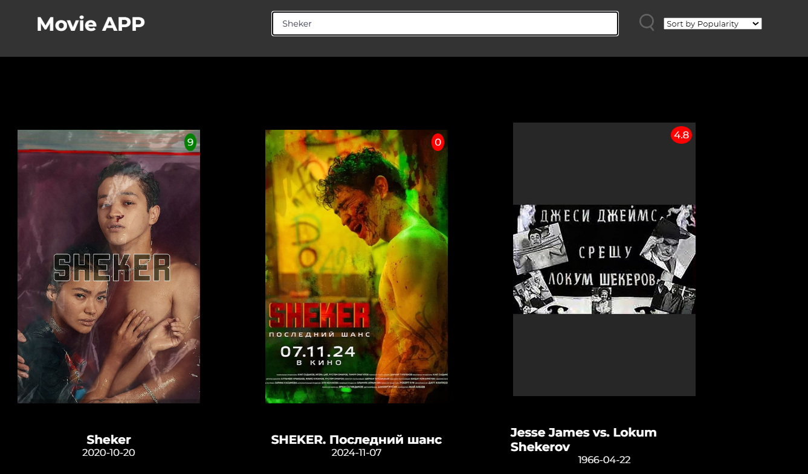
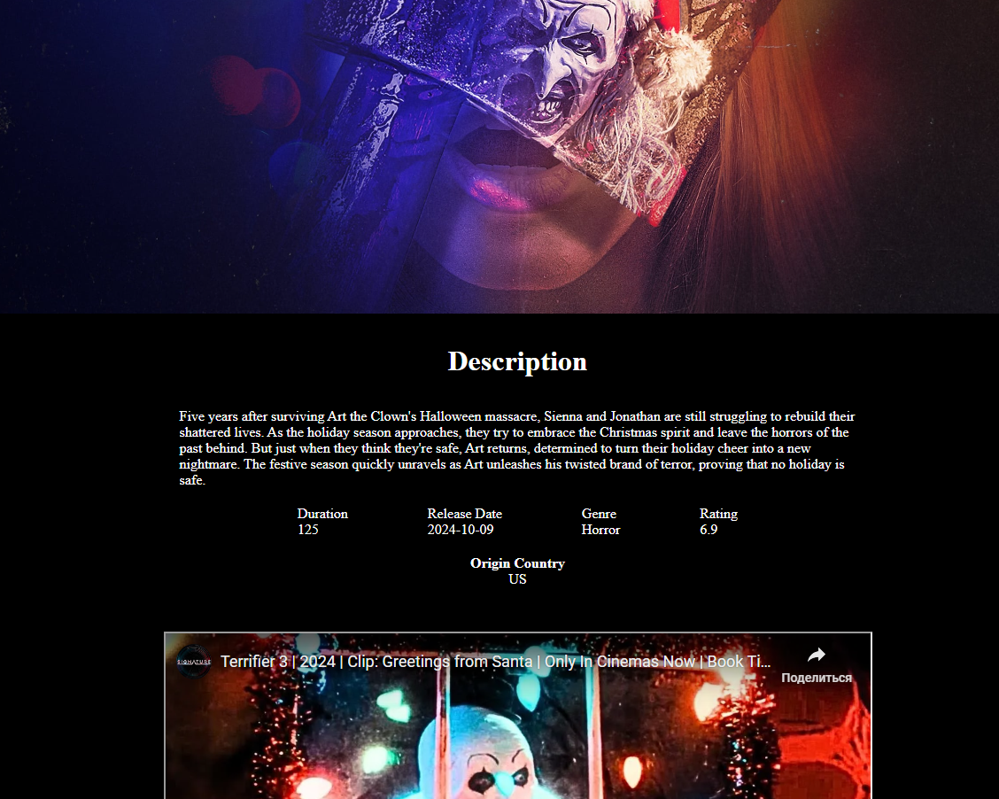
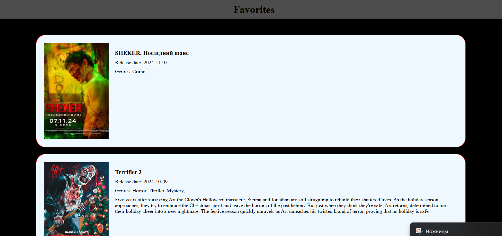
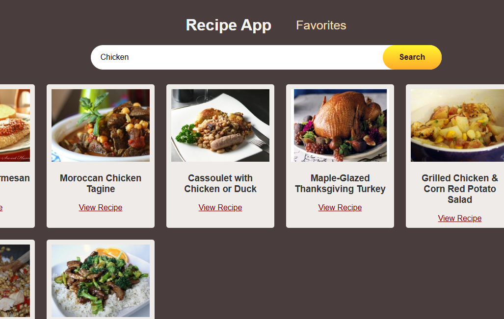
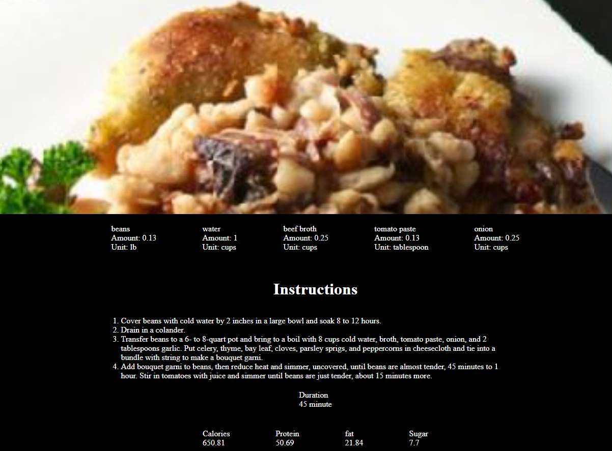
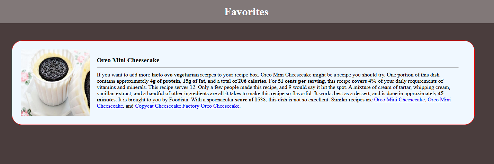

# Project 2: web-front

## Overview
This repository contains three applications:

1. **Weather App**: Provides current weather information based on user location or search query.


2. **Movie App**: Displays a list of movies and allows users to click on a movie to see its details.




3. **Recipe App**: Helps users search for recipes by ingredient or keyword and provides detailed cooking instructions.




## Setup Instructions
To run any of the apps locally, follow these steps:

1. **Clone the repository:**
   ```bash
   git clone https://github.com/daniyarzhalgas/project-2-frontend.git
   cd movie-app
   and just open index.html with your browser
